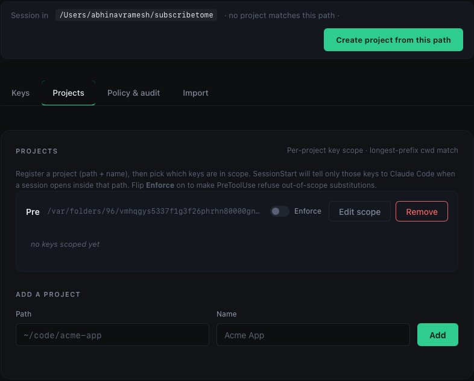
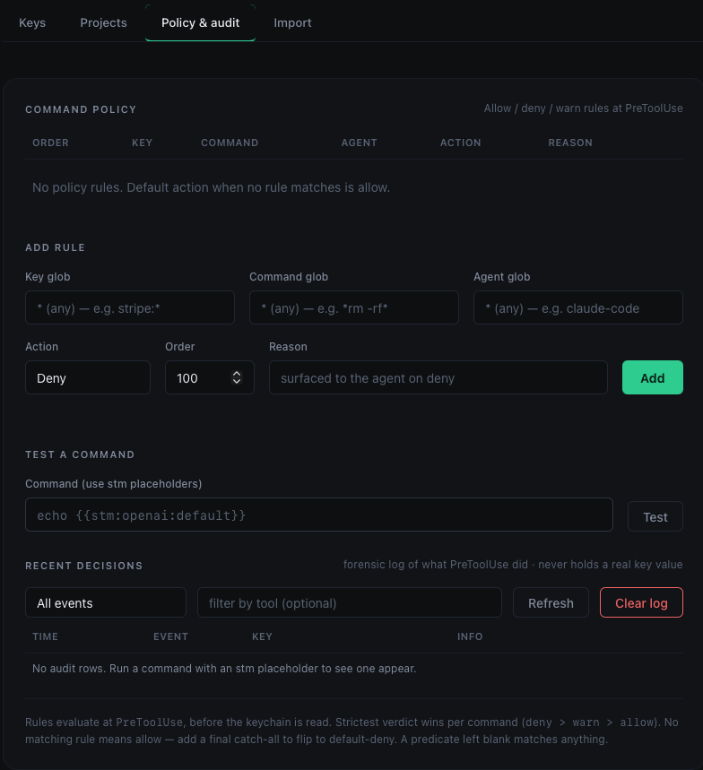
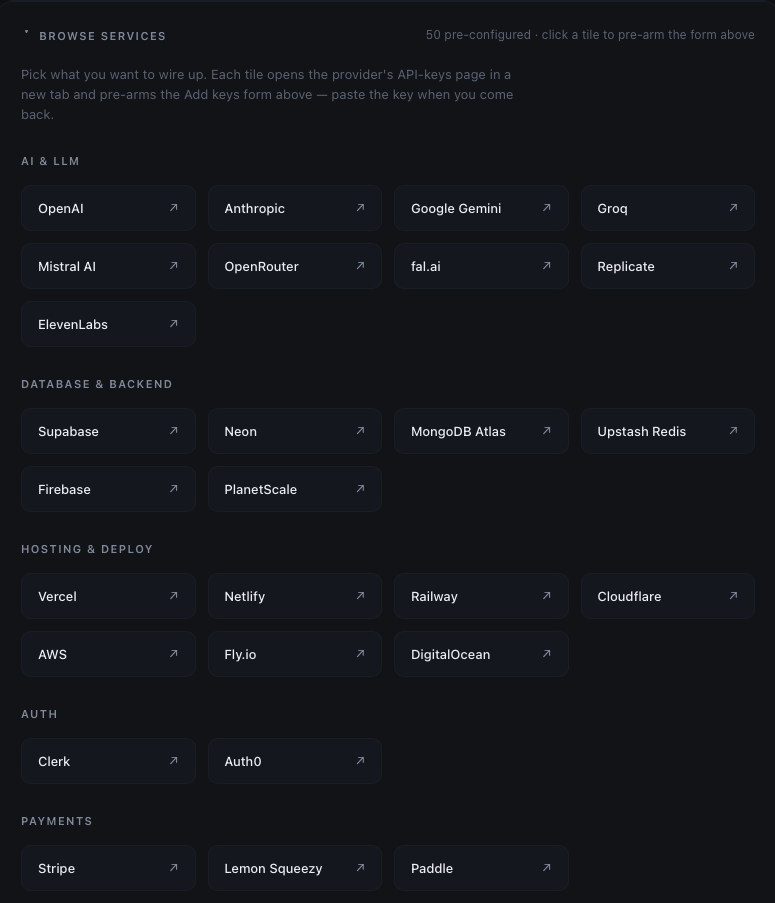

# subscribetome — full documentation

> **Looking for the 30-second pitch?** See [`README.md`](./README.md).
> This file is the long-form reference for every command, the security
> model, and the cross-platform / Codex surfaces.

🌐 **[subscribetome.pro](https://subscribetome.pro)** — marketing site.

You have keys for a dozen AI tools, scattered across `.env` files and provider
dashboards. subscribetome puts them in one place and lets Claude Code *use* them
without ever seeing them. The model only sees a placeholder like
`{{stm:openai:default}}`; the real key is swapped in at the moment a command
runs.


The dashboard splits into four tabs (Keys / Projects / Policy & audit / Import), each covered below.

https://github.com/matterhornso/subscribetome/raw/main/docs/screenshots/dashboard-tour.webm

> A short tour of all four tabs. Click to play.

### Dashboard tour

**Projects — separate keys per project, longest-prefix `cwd` match**



Register a project (path + name), pick which keys are in scope, optionally flip **Enforce** on to make PreToolUse refuse out-of-scope substitutions. SessionStart only tells Claude Code about the in-scope keys when a session opens inside that path.

**Command policy & audit — assign restrictions for each key usage**



Glob-matched allow / deny / warn rules evaluated at PreToolUse. Test a command against the active rules before you save. The audit log is a forensic record of every PreToolUse decision (substitute / policy.deny / policy.warn / unresolved / malformed) — and crucially, it never holds a real key value.

**Browse services — 50 services pre-configured**



Pick a service, click it, the form pre-fills with its standard credential labels. Categories: AI & LLM, Database & Backend, Hosting & Deploy, Auth, Payments, and more. "Other" handles anything not in the catalog.

## Install

The quickest path is to paste this into Claude Code:

> Set up subscribetome for me using https://github.com/matterhornso/subscribetome

The agent reads the install block in [`README.md`](./README.md) and runs the
plugin marketplace install for you.

**To install by hand:**

```
claude plugin marketplace add matterhornso/subscribetome
claude plugin install stm@subscribetome
```

Then quit and reopen Claude Code to activate it.

Requires [Claude Code](https://claude.com/claude-code) and [Bun](https://bun.sh).

## Use it

1. Run the slash command `/stm:dashboard`. A web page opens on
   localhost.
2. Pick your service (Supabase, Twitter, Stripe, …) and the form shows its
   standard credential fields — or choose **Other** for anything custom. Fill
   the fields you have; each value goes straight to your macOS Keychain, never
   the chat. Need a credential the catalog doesn't list? **+ Add another field**
   stores it under your own label. You get back a placeholder for each, e.g.
   `{{stm:openai:default}}` or `{{stm:supabase:service-role-key}}`.
3. Write that placeholder in any command (an `Authorization: Bearer` header, an
   env var, anything). When the command runs, the real key is swapped in. The
   conversation only ever holds the placeholder.

That is the whole loop.

**You don't even need to know the placeholder syntax.** Once installed, every
Claude Code session automatically knows your keys live in stm. Just say what
you want in plain language — *"use my fal.ai key to make a short video"* — and
Claude looks up the placeholder itself and wires it into the command. Nothing
to configure: the plugin teaches each new session on its own.

---

## How it works

The model only ever sees placeholders. The real key lives in the macOS Keychain
and is materialized only inside a `PreToolUse` hook that rewrites a command the
instant before it runs:

```
model writes:   curl -H "Authorization: Bearer {{stm:openai:default}}" ...
                       |
        PreToolUse hook |  substitutes the real key
                       v
shell runs:     curl -H "Authorization: Bearer sk-...real..." ...
```

Two guardrail hooks back it up:

- **UserPromptSubmit** blocks a prompt that contains a raw key — or any secret
  stm already manages, including a plain password with no key shape. Secrets
  must never go through the chat.
- **PostToolUse** flags command output that leaked a key (a command that echoed
  or errored with its own input) and tells you to rotate it.

A fourth hook, **SessionStart**, teaches every new session how to use stm — so
Claude knows to look keys up and use placeholders with no per-project setup.

## Commands

Slash commands (after installing the plugin):

| Command | Does |
|---|---|
| `/stm:dashboard` | open the localhost dashboard |
| `/stm:inventory` | list keys, subscriptions, monthly spend |
| `/stm:import` | scan `.env` files for keys to import |
| `/stm:revoke` | mark a key revoked |

The `stm` CLI (on `PATH` once installed):

```
stm dashboard           open the localhost web UI
stm list                keys, subscriptions, monthly spend
stm import [dir]        scan .env files for keys to import
stm revoke <tool> <l>   mark a key revoked
stm rotate <tool> <l>   open provider dashboard, paste new key, swap in place
stm policy <subcmd>     allow / deny / warn rules at PreToolUse
stm project <subcmd>    per-project key scope
stm audit               forensic log of PreToolUse decisions
stm sync [provider]     fetch real spend from configured providers
stm codex [args...]     launch Codex with stm keys as env vars
stm codex install-hooks install the UserPromptSubmit + SessionStart guardrails in ~/.codex/config.toml
stm codex install-mcp   register Codex Option 2 (MCP-wrapped, higher assurance — key never in agent process)
stm codex doctor        verify both Codex hooks AND MCP are wired up
stm doctor              diagnose which keystore tier is active and how to upgrade
stm vault <subcmd>      backup/restore the entire inventory + keys; manage Tier 3 vault
stm vault export <file> passphrase-encrypted snapshot of inventory + keys
stm vault import <file> restore from a snapshot
stm status              daemon + inventory summary, active agents + backend
stm stop                stop the dashboard daemon
stm uninstall           remove all stm data + Codex blocks from this host
stm --version           print the installed stm version
```

### Spend sync — network posture

`stm sync` is the only feature that makes outbound network calls.
**stm makes outbound network calls only when you click sync, only to the
providers you've configured. No background activity, no telemetry, no
phone-home.** Each sync-enabled provider needs a separate admin-scoped
credential (e.g. `{{stm:openai:admin-key}}` for OpenAI) — add it in the
dashboard, then run `stm sync` or click "Sync spend" in the header.

## Placeholder grammar

A placeholder is `{{` `stm` `:` `<tool>` `:` `<label>` `}}` written with no
spaces. `<tool>` and `<label>` are lowercase `[a-z0-9-]`, 1-64 characters each.
The `(tool, label)` pair is the global address of a key. Substitution is an
**exact** match — a malformed placeholder is never substituted; it is blocked
with a did-you-mean suggestion.

## Security model

- Key values live in the **macOS Keychain**, never in subscribetome's database
  and never in the Claude Code conversation.
- The `PreToolUse` hook substitutes a key only into **Bash** commands — never
  into a file. A placeholder written to a file is just the harmless token; what
  the hook blocks in a `Write`/`Edit` is a **raw key** about to be persisted to
  a file.
- The dashboard daemon binds to `127.0.0.1`, requires a per-run auth token, and
  enforces a Host/Origin allowlist (DNS-rebinding defense).
- Hooks **fail safe**: on any internal error a hook exits without substituting,
  so a failure can never leak a key — at worst a command runs with an
  un-substituted placeholder and simply fails.

### What it cannot do

- **Output redaction is impossible.** A hook can only *block* a tool result that
  contains a key, not silently scrub it. PostToolUse flagging is reliable for
  keys subscribetome manages and best-effort for others.
- A command that prints its own arguments (`set -x`, verbose or error output)
  can still surface a substituted key in that command's output. PostToolUse
  *detects* this after the fact and tells you to rotate the key — it cannot
  prevent the leak.
- While a command with an injected key runs, the real key is an argument of
  that process — briefly visible to `ps` for other local processes. Injecting
  a secret into a shell command inherently requires this; subscribetome keeps
  the key out of the *conversation*, not out of the local process table.

## Compatibility — agents

stm wraps Claude Code and Codex today. Codex ships with two integration
modes (different security postures); pick one. `stm status` and the
dashboard header always tell you which agent gets which guarantee.

| Agent | Mode | Guarantee | What you run |
|---|---|---|---|
| **Claude Code** | per-command rewrite | **Strong** — the real key is substituted into a single Bash command at the instant it runs, via a `PreToolUse` hook returning `updatedInput`. The transcript keeps the placeholder; no value ever appears in chat. | `claude` (the plugin's hooks fire automatically) |
| **Codex (Option 1)** | session-env mode | **Medium** — each key becomes a `STM_<TOOL>_<LABEL>` env var in codex's process environment for the whole session. A command that dumps its environment can surface it. | `stm codex [codex-args…]` |
| **Codex (Option 2)** | MCP-wrapped (v0.7.0) | **Strong** — the key never enters the agent's address space at all. Codex invokes a named MCP tool; stm's MCP server makes the HTTPS request and returns the response. Structurally closest equivalent to Claude Code's guarantee. | `stm codex install-mcp` once, then prompt codex to use the `stm_http_request` tool |

Why Codex is weaker: Codex CLI's hook system has a `PreToolUse` event but its
docs state that `updatedInput` is "parsed but not supported yet, so they fail
open" — the v1 per-command rewrite cannot port. Session-env mode is the
honest baseline we ship today. Tracking openai/codex#18491: when
`updatedInput` lands, a third Codex mode (per-command rewrite, drop-in
replacement for the Claude Code adapter) becomes possible.

Cursor, opencode, and the MCP-wrapped Codex mode (Option 2 of
`specs/cross-platform-and-codex.md` §6) are roadmap; the agent surface
is now plural and they plug into it without breaking either of the
modes above.

### Codex guardrails — UserPromptSubmit + SessionStart

The env-injection launcher (above) handles "the agent uses keys without
the model typing them." The guardrails handle the other two pieces v1
ships on Claude Code: blocking a raw key a user pastes into chat
(`UserPromptSubmit`), and teaching every session how to use stm-managed
keys (`SessionStart`). On Codex these wire in through Codex's own hook
config:

```
stm codex install-hooks            # writes the block in ~/.codex/config.toml
stm codex install-hooks --dry-run  # print what it would write, don't touch disk
stm codex install-hooks --remove   # uninstall the guardrails
stm codex doctor                   # verify the wiring; exit 0 = healthy
```

The installer writes a marker-delimited block between
`# stm: subscribetome managed-hooks v1` and
`# stm: end subscribetome managed-hooks` — everything above and below the
markers is preserved. A timestamped backup is left next to the file.

**Trust gate.** On first launch after install, Codex prompts you to
TRUST each hook (it records trust against the hook command's hash).
Until you approve, the hook is silently skipped — `stm codex doctor`
reports "OK" but no guard fires. Press `y` when prompted. See
[developers.openai.com/codex/hooks#trust](https://developers.openai.com/codex/hooks#trust).

### Codex Option 2 — MCP-wrapped (higher assurance, v0.7.0)

Option 1 (above) leaves the key in codex's process environment for
the whole session — a command that dumps its env can surface it.
Option 2 keeps the key **entirely inside stm's MCP-server process**;
codex's agent invokes a named tool and never handles the secret. This
is the structurally closest equivalent to Claude Code's per-command
rewrite that Codex can host today.

```
stm codex install-mcp              # add the [mcp_servers.subscribetome] block
stm codex install-mcp --dry-run    # print what it would write
stm codex install-mcp --remove     # uninstall
```

The block registers `bun src/cli.ts codex mcp-server` as a Codex
MCP server. When the agent starts, Codex spawns the server over
stdio and discovers a new tool:

- **`stm_http_request(provider, path, method?, query?, headers?, body?)`** —
  the server resolves the provider's credential from the local stm
  KeyStore, injects the auth header on the outbound HTTPS request,
  and returns the response (status, headers, body) to the agent.
  The credential never enters the agent's address space.

**Launch set of providers (v0.7.0):** OpenAI, Anthropic, Stripe,
GitHub, Resend. Adding a provider is one PR — see
`src/agents/codex-mcp-providers.ts`.

**Prompting tip:** "Use the stm_http_request MCP tool to call
OpenAI's chat completions endpoint with these messages…" — codex
will invoke the tool by name; the key never lands in any prompt or
command argument.

**Hooks + MCP coexist.** The two installers manage SEPARATE marker
pairs in `~/.codex/config.toml`. You can run either independently
or both. `stm codex doctor` reports both tracks.

## Supported platforms

- **macOS** — keys live in the macOS Keychain. Since v0.6.1 stm
  calls the Security framework directly through
  [Bun FFI](https://bun.com/docs/api/ffi) (`SecKeychainAddGenericPassword`
  / `SecKeychainFindGenericPassword` / `SecKeychainItemDelete`); the
  v1 `security -w <value>` shell-out is gone, so the secret bytes
  never touch argv. Posture parity with the Linux Secret Service
  and Windows Credential Manager backends.
- **Linux desktop** — keys live in the Linux Secret Service (libsecret,
  via `secret-tool`). Install `libsecret-tools` (Debian/Ubuntu),
  `libsecret` (Fedora), or `libsecret` (Arch). Requires a running
  desktop keyring daemon (`gnome-keyring-daemon` on GNOME; `kwallet`
  with the secret-service shim on KDE).
- **Windows** — keys live in Windows Credential Manager (DPAPI-
  encrypted, per-user) via the Win32 `wincred` API. We call
  `CredWriteW` / `CredReadW` / `CredDeleteW` directly through
  [Bun FFI](https://bun.com/docs/api/ffi) — not via the
  read-incapable `cmdkey` CLI, and not via the archived `keytar`
  package. The secret bytes go into `CREDENTIALW.CredentialBlob`
  by pointer; they never touch argv, stdin, or any environment
  variable. Available on Windows 10 / 11 (all SKUs) and Windows
  Server.
- **Linux headless / SSH / container / WSL** — tiered fallback chain
  (since v0.6.0). The resolver tries each tier in order and picks the
  first that works. **Never silent**: `stm doctor` always reports
  which tier is active and what would need to change to reach the
  next-stronger tier.
  - **Tier 2: `pass` + GPG.** If `pass` is on PATH and `pass ls`
    succeeds (a GPG-initialised store exists), keys live under
    `~/.password-store/subscribetome/`. Works over SSH with agent
    forwarding. Same posture as Linux Secret Service: secret bytes
    via stdin, never argv.
  - **Tier 3: EncryptedFile (opt-in).** Last resort for hosts with
    no keyring daemon AND no `pass`. PBKDF2-SHA512 (600 000
    iterations) derives an AES-256-GCM key from a user passphrase;
    the vault is one file at `$XDG_DATA_HOME/subscribetome/keys.enc`
    (mode 0600). **Opt in once** with `STM_ALLOW_FILE_BACKEND=1`
    (or `STM_KEYSTORE=encrypted-file`); after that the file's
    existence is the consent for subsequent runs.

`stm status` always tells you which backend is active. `stm doctor`
prints the full tier diagnosis with the exact commands to reach the
next-stronger tier. You can force one with
`STM_KEYSTORE=<mac|linux-secret-service|linux-pass|encrypted-file|windows-credential>`
(useful in CI; aliases: `keychain`, `libsecret`, `secret-service`,
`pass`, `file`, `wincred`, `credential-manager`).

The v0.5 – v0.7 Windows + Linux-headless + Codex builds were done on
macOS and exercised via injected fakes (FFI for Windows, JSON-RPC
framing for Codex MCP, passphrase TTY for EncryptedFile). Real-host
verification is welcome — see
[`FIELD_VERIFICATION.md`](./FIELD_VERIFICATION.md) for the
per-surface checklist.

### Encrypted-file vault (Tier 3) — passphrase UX

```
stm doctor                       # see which tier is active + how to upgrade
stm vault info                   # path, mode, magic, KDF id of the local vault
stm vault unlock                 # cache the passphrase for this process
stm vault rotate-passphrase      # decrypt under old, re-encrypt under new (.bak left)
```

For non-interactive use (CI, devcontainers), set
`STM_FILE_PASSPHRASE=<passphrase>` and the backend reads it directly.
When neither the cache nor the env var has a passphrase **AND** stdin
is not a TTY, `get()` returns `null` and the PreToolUse hook fails
safe — exits 0 without rewriting, so the command runs with the
placeholder intact and fails harmlessly (never leaks a key).

## Limitations (v1.0)

- **Import is `.env`-only** — scanning third-party password managers
  (1Password, Bitwarden, Doppler) for keys is deferred. Specs welcome
  the contribution.
- **`revoke` is a metadata flag.** It marks the key inactive in stm's
  inventory but does not call a provider API. Use `stm rotate` to
  actually swap a key value in place (opens the provider dashboard, you
  paste the new value, the placeholder address stays the same).
- **Spend sync covers OpenAI and Anthropic admin APIs.** Other providers
  don't expose programmatic usage; their spend is whatever you declared
  via `stm add --cost`.

See [`TODOS.md`](./TODOS.md) for the deferred v1.1+ scope and
[`FIELD_VERIFICATION.md`](./FIELD_VERIFICATION.md) for the per-platform
verification checklist (Windows + Linux tiers built but pending
real-hardware confirmation).

## Development

```
git clone https://github.com/matterhornso/subscribetome
cd subscribetome
bun test               run the test suite
bun src/cli.ts <args>  run the CLI from source
```

Runtime state lives in `~/.subscribetome/` (the SQLite inventory and the
daemon descriptor). Key values are in the OS keystore — macOS Keychain
(service `subscribetome`), Windows Credential Manager (target prefix
`Subscribetome:`), Linux Secret Service / `pass` / encrypted-file vault
depending on which tier is reachable. See `stm doctor` for the active
backend.

## Project

- [`CONTRIBUTING.md`](./CONTRIBUTING.md) — how to send a change, and how to add
  a service to the catalog (a one-line, data-only contribution).
- [`SECURITY.md`](./SECURITY.md) — the threat model and how to report a
  vulnerability privately.
- [`CHANGELOG.md`](./CHANGELOG.md) — release history.
- [`TODOS.md`](./TODOS.md) — the deferred v1.5 scope.
- [`specs/`](./specs/README.md) — the design docs that drive the
  roadmap beyond v1. The [spec index](./specs/README.md) lists every
  spec with its target version, current status, and the dependency
  graph between them. Today's specs cover cross-platform support,
  spend visibility, per-project key scope, command policy, and the
  audit log.

## License

MIT — see [`LICENSE`](./LICENSE).
