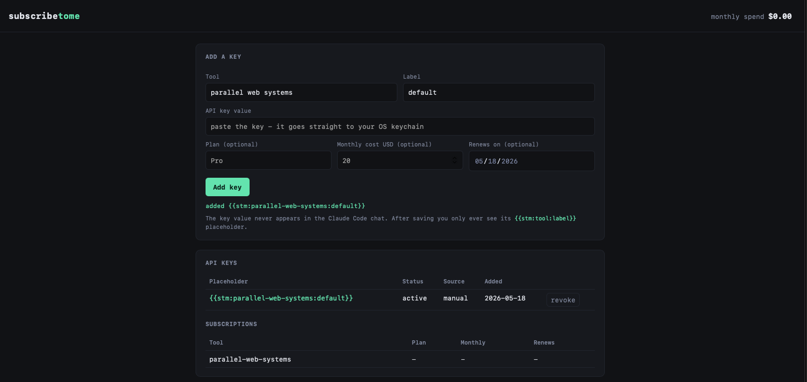
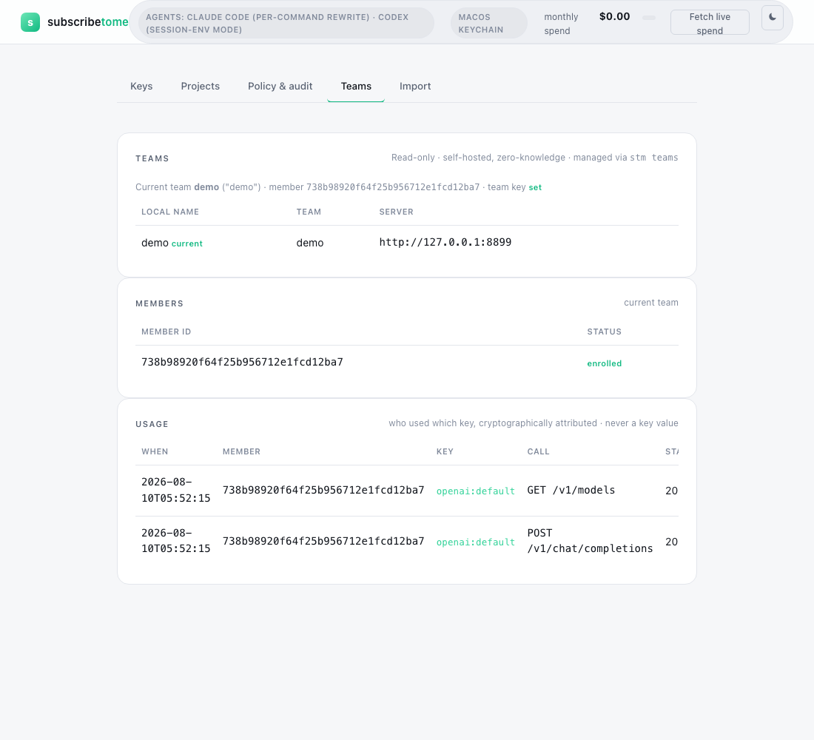

# subscribetome

[](https://github.com/matterhornso/subscribetome/actions/workflows/test.yml)

**Your API keys in the OS keychain. Your AI coding agent uses them — without ever seeing them.**

The model writes `{{stm:openai:default}}`. The real key is swapped in at the moment the command runs. Keys never touch the chat, the transcript, or your logs — they live only in your OS keychain (or, on other platforms, an AES-256-GCM vault).



`stm` starts as a personal key manager and grows with you: a **credential broker** so an agent can call HTTP APIs with a key it never sees, and **STM Teams** — a self-hostable, zero-knowledge server for sharing credentials and attributing usage across a team. Everything is free, open source, local-first, and zero-telemetry.

## 1. Install

Paste this into Claude Code:

> Set up subscribetome for me using https://github.com/matterhornso/subscribetome

Quit and reopen Claude Code when it's done.

## 2. Add a key

```
/stm:dashboard
```

A local web page opens. Pick a service (OpenAI, Anthropic, Stripe, GitHub, …), paste the key. The key goes straight to your OS keychain — never through chat.

## 3. Use it

Just ask:

> Use my OpenAI key to call chat completions with the message "hello"

Claude Code sees a placeholder. The plugin swaps in the real key the instant the command runs.

---

## The credential broker — for HTTP APIs

Substituting a key into a shell command works everywhere, but has a ceiling: for the moment the command runs, the key is a real argument (visible to `ps`, leakable if the command echoes its own arguments). For HTTP APIs, point the request at the local daemon instead:

```
curl http://127.0.0.1:<port>/proxy/openai/default/v1/models
```

`stm` resolves the credential from the keychain and attaches the real auth on the **outbound** call to the provider — the key never enters the command's argv, environment, or output. An SSRF guard keeps it on the target's own origin, the response is scrubbed of the key, and every brokered call is a first-class audit event.

```
stm broker              print the base URL + a loopback-only capability token
```

## STM Teams — share credentials, attribute usage

Run your own sync server (`stm teams serve`); it stores **only ciphertext it cannot decrypt**. Credentials are encrypted on a member's machine with a team key the server never sees. Members enroll by **public key** — no shared passphrase is ever passed around — and every usage report is **signed**, so the team log attributes "who used which key" to a cryptographically-verified member, never a self-asserted name.

```
stm teams init          create a team (admin)
stm teams join          join from a member machine
stm teams share <k>     mark a key shared with the team (keys are personal by default)
stm teams push / pull   sync the encrypted vault
stm teams usage         who used which key, cryptographically attributed
```

A machine can belong to several teams at once (`stm teams list` / `use <name>`), and the dashboard has a read-only **Teams** tab that shows members and the signed usage log.



---

## What it is

`stm` is API-key security for AI coding agents, keychain-first: the real value lives in the OS keychain and the agent works through placeholders. Four Claude Code hooks make it load-bearing — **PreToolUse** substitutes the key the instant before a command runs; **UserPromptSubmit** blocks a raw secret pasted into chat; **PostToolUse** flags output that leaked a key and tells you to rotate it; **SessionStart** teaches every new session the workflow with no per-project setup.

**This beta is scoped to macOS + Claude Code** — the runtime hooks that rewrite commands are strongest there. Linux and Windows are experimental (the Bash hook may not fire on native Windows), and Codex is experimental. The broker and the Teams server are plain Bun programs and run anywhere Bun does. Free. Open source. Zero telemetry.

---

**More:** [`DOCS.md`](./DOCS.md) — every command, the security model, the broker, Teams, and the Codex surface · [docs site](https://subscribetome.pro/docs.html) · [`SECURITY.md`](./SECURITY.md) — the threat model + how to report a vulnerability · [`CHANGELOG.md`](./CHANGELOG.md) · [`CONTRIBUTING.md`](./CONTRIBUTING.md) · MIT licensed
